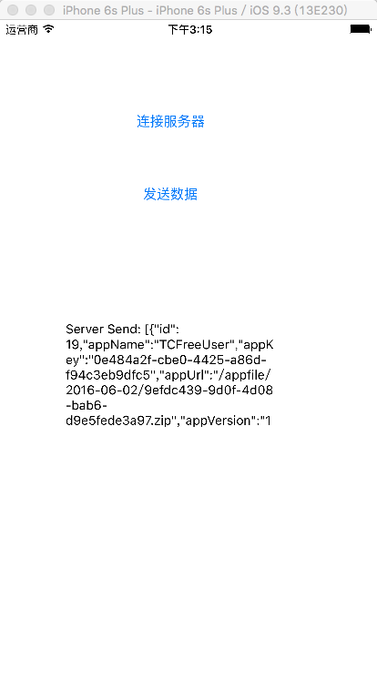

# MinaDemo

## Overview
一个apache mina 的 Demo

## 更新
2016.9.7 更新Jmeter自定义测试项目(不能根据服务端返回结果判断测试结果)
2016.9.6 更新多路分离解码器，支持两套协议

## 项目

TCCodeVersion web服务端

	src/main/java/com/tccv/mina/MinaProtocolHandler  socket服务端
	src/main/java/com/tccv/mina/MinaClientSupport   socket客服端
MinaClient IOS客户端

## 业务
客户端向服务端发送一条消息，服务端从数据库查询一个列表数据返回给客户端

## IOS测试图

